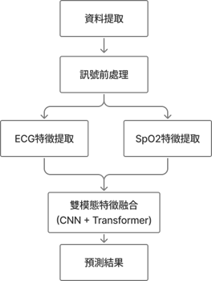

# apnea

  # 🛌 多源訊號融合：應用雙模態機器學習於睡眠呼吸中止症之偵測
> **Multi-Source Signal Fusion: A Bimodal Machine Learning Approach for Sleep Apnea Detection**

⚠️ **【學術聲明 / Disclaimer】**
> 本專案為碩士學位論文研究之一部分，目前正進行最終數據驗證與學術發表準備。為保護原創性與智慧財產權（IP），**完整之模型原始碼與生理數據集目前暫不公開**。
> 本頁面旨在展示本研究之系統架構、工程邏輯與資料處理方法。詳細技術實作細節，歡迎於面試中進一步交流。

---

## 💡 專案背景 (Background)
傳統的睡眠呼吸中止症（Sleep Apnea）檢測，通常需要患者在醫院睡上一晚（PSG 檢測），不僅耗時、成本高昂，且佔用大量醫療資源。
本研究旨在透過**機器學習演算法**，導入自動化的輔助辨識模型，以期大幅提升醫療端的初步診斷效率，降低檢測門檻。

## ⚙️ 系統架構與研究方法 (Methodology)

### 1. 雙模態訊號處理 (Bimodal Signal Processing)
捨棄單一維度的侷限，本研究採用多源訊號融合策略，主要處理兩大核心生理數據：
* **心電圖 (ECG)**
* **血氧濃度 (SpO2)**

*(💡 提示：建議在此處放入一張你論文裡的「系統架構流程圖 (Block Diagram)」截圖，讓主管秒懂你的邏輯)*
### 2. 克服數據挑戰 (Overcoming Data Challenges)
在實際的醫療生理數據中，存在許多工程挑戰。本專案透過嚴謹的 Python 腳本完成以下前處理：
* **雜訊濾除 (Noise Filtering)：** 處理環境與硬體造成的生理訊號雜訊干擾，確保特徵乾淨。
* **資料不平衡 (Data Imbalance)：** 針對病患與健康樣本比例懸殊的問題，實作有效的資料擴增與重採樣策略，防止模型產生偏見。

### 3. 模型訓練與優化 (Model Training)
* 透過反覆的邏輯拆解與參數調校 (Debug & Fine-tuning)，建構穩定的預測模型。
* 成功將非結構化的生理特徵，轉化為具備臨床輔助價值之預測結果。

## 🚀 階段性成果 (Current Results)
* 已完成核心數據分析與特徵萃取流程。
* 成功訓練出具備穩定辨識能力之機器學習模型，目前正進行參數最佳化與論文撰寫。

*(💡 提示：建議在此處放入一張不含機密數據的「模型準確率圖表」或「Confusion Matrix」，增加視覺說服力)*
---
*Developed by Jia-Yi Chou (周嘉頤) | 淡江大學電機工程學系碩士班*
